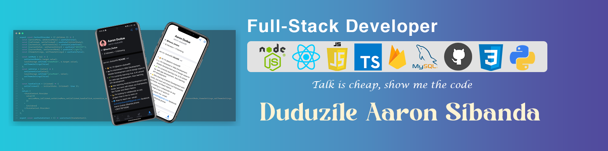

<!-- Banner -->

 
 
<h1 align="center">Hi 👋, I'm Duduzile Aaron Sibanda</h1>
<h3 align="center">A motivated fullstack developer from Zimbabwe who has a passion for working on fully functional web projects and learn new things along the way.</h3>

  

- 🔭 I’m currently working on [a farm operations management web api that manages all the activities on a farm from expenses, products, customers, farm inputs, e.t.c](https://github.com/aaron-dudue99/farm-operations-mgmt)

- 🌱 I’m currently learning **NestJS for backend and Angular for frontend**

- 👯 I’m looking to collaborate on **any project that can get me to acquire more skill and experience while coding it**

- 💬 Ask me about **react, javascript**

- 📫 How to reach me **duduzilesibanda99@gmail.com or via phone at +263776712092**

 
<h3 align="left">Connect with me:</h3>

 
 

<!-- Languages and tools that I use -->

<b>Languages and Tools:</b>

 

  &emsp; &emsp; &emsp;
&emsp; &emsp;  &emsp;     &emsp; &emsp; &emsp; &emsp; &emsp; &emsp;   &emsp; &emsp;  &emsp;    &emsp; &emsp;    &emsp;      &emsp;  &emsp;   

 

 
<!-- Work Summary -->

<b>Work Summary</b>

 

 

 

 

